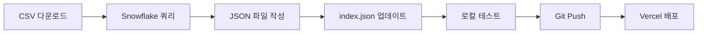

# FNF 재무제표 대시보드 프로젝트

> **F&F 월별 재무실적 분석 및 대시보드**
>
> Production URL: https://fnf-dashboardv2.vercel.app

---

## 📊 프로젝트 개요

F&F 재무제표 데이터를 시각화하고 월별 재무 분석을 제공하는 대시보드 프로젝트입니다.

**주요 기능:**
- 월별 손익계산서 (Income Statement)
- 재무상태표 (Balance Sheet)
- 운전자본 분석 (Working Capital)
- 여신 검증 (Credit Verification)
- 브랜드별/채널별 매출 분석
- AI 기반 재무 인사이트

---

## 🗂️ 폴더 구조

```
C:\Users\AC1144\AI_Fin_Analysis\Claude\Monthly_Report\
│
├── 📁 fnf-dashboard_v2/              ⭐ 메인 대시보드 프로젝트
│   ├── src/
│   │   ├── app/                      # Next.js 페이지
│   │   │   ├── page.tsx              # 경영요약 (홈)
│   │   │   ├── income-statement/     # 손익계산서
│   │   │   ├── balance-sheet/        # 재무상태표
│   │   │   └── layout.tsx            # 공통 레이아웃
│   │   ├── components/               # React 컴포넌트
│   │   │   ├── dashboard/            # 대시보드 전용
│   │   │   ├── ui/                   # shadcn/ui 컴포넌트
│   │   │   └── providers/            # Context Provider
│   │   ├── data/                     # 월별 JSON 데이터
│   │   │   ├── index.json            # 사용 가능한 월 목록
│   │   │   ├── 2026-01.json          # 26년 1월 데이터
│   │   │   ├── 2025-12.json          # 25년 12월 데이터
│   │   │   └── 2025-11.json          # 25년 11월 데이터
│   │   ├── types/                    # TypeScript 타입 정의
│   │   └── lib/                      # 유틸리티 함수
│   ├── package.json                  # 의존성 관리
│   └── vercel.json                   # 배포 설정
│
├── 📁 Monthly_Report_Guides/         📚 분석 가이드 모음
│   ├── FNF_Dashboard_Data_2601.ts    # 26년 1월 데이터 (TypeScript)
│   ├── FNF_Dashboard_Data_2601.json  # 26년 1월 데이터 (JSON)
│   ├── FNF_손익CO_데이터_가이드.md      # 손익(CO) 데이터 추출
│   ├── fnf_sales_guide_v7.md         # 매출 분석 가이드
│   ├── fnf_ar_analysis_guide_v1.md   # 매출채권(AR) 분석
│   ├── fnf_inventory_cost_analysis_guide_v1.md  # 재고 원가 분석
│   └── ... (기타 가이드 문서들)
│
├── 📁 archive/                        🗄️ 작업 파일 보관소
│   ├── temp_files/                   # 임시 파일 (68개)
│   ├── python_scripts/               # Python 스크립트 (30개)
│   ├── old_html_files/               # 구버전 HTML (4개)
│   ├── old_docs/                     # 구버전 문서 (4개)
│   └── README.md                     # Archive 설명
│
├── 📁 fnf-dashboard/                  ⚠️ 구버전 (삭제 예정)
│
├── 📄 F&F 월별재무제표(26.01).csv     💾 26년 1월 재무상태표
├── 📄 FNF_Dashboard_Monthly_Update_Guide_v3.md  📖 최신 업데이트 가이드
└── 📄 README.md                       📌 이 파일

```

---

## 🚀 빠른 시작

### 1. 개발 서버 실행
```bash
cd fnf-dashboard_v2
npm install
npm run dev
# http://localhost:3000 접속
```

### 2. 프로덕션 배포
```bash
git add .
git commit -m "Update: 월별 데이터"
git push origin main
# Vercel 자동 배포
```

### 3. 월별 데이터 업데이트
```bash
# 1. 기존 JSON 복사
cd fnf-dashboard_v2/src/data
cp 2026-01.json 2026-02.json

# 2. 새 파일 편집 (meta, financialData 등)
# 3. index.json 업데이트 (availableMonths, defaultMonth)
# 4. 테스트 및 배포
```

자세한 가이드: `FNF_Dashboard_Monthly_Update_Guide_v3.md`

---

## 📚 주요 문서

| 문서 | 용도 | 위치 |
|:---|:---|:---|
| **월간 업데이트 가이드 v3** | 매월 데이터 업데이트 절차 | 루트 |
| **손익CO 데이터 가이드** | COPA 쿼리 및 영업이익 계산 | `Monthly_Report_Guides/` |
| **매출 분석 가이드 v7** | 매출 데이터 추출 및 분석 | `Monthly_Report_Guides/` |
| **AR 분석 가이드 v1** | 매출채권 여신 검증 | `Monthly_Report_Guides/` |
| **재고 원가 분석 가이드 v1** | 재고 원가 분석 | `Monthly_Report_Guides/` |

---

## 🛠️ 기술 스택

**프론트엔드:**
- Next.js 16.1.1 (App Router + Turbopack)
- React 19
- TypeScript
- Tailwind CSS
- shadcn/ui

**데이터:**
- Snowflake (FNF.SAP_FNF.DW_COPA_D)
- F&F 월별재무제표 CSV

**배포:**
- Vercel (자동 배포)

**개발 도구:**
- Git
- Claude AI

---

## 📊 데이터 소스

### 1. 재무상태표 (Balance Sheet)
- **출처**: `F&F 월별재무제표(YY.MM).csv`
- **제공**: 회계팀
- **항목**: 총자산, 부채, 자본, 현금, 매출채권, 재고 등

### 2. 손익계산서 (Income Statement)
- **출처**: Snowflake `FNF.SAP_FNF.DW_COPA_D`
- **조회**: SQL 쿼리
- **항목**: 매출액, 매출원가, 점수수료, 판관비 등

### 3. 브랜드별/채널별 매출
- **출처**: Snowflake `DW_COPA_D`
- **분류**: MLB, Discovery, MLB KIDS, Duvetica, Sergio Tacchini

---

## 📝 데이터 업데이트 체크리스트

```
□ 1. CSV 파일 확인
   - F&F 월별재무제표(YY.MM).csv 다운로드

□ 2. Snowflake 쿼리 실행
   - 월별 손익 데이터
   - 브랜드별 국내/수출 매출
   - 채널별 매출

□ 3. JSON 파일 생성
   - src/data/YYYY-MM.json 작성
   - meta, financialData, incomeStatement 등 입력

□ 4. index.json 업데이트
   - availableMonths 배열에 새 월 추가
   - defaultMonth 업데이트

□ 5. 로컬 테스트
   - npm run dev
   - 모든 페이지 확인

□ 6. 배포
   - Git commit & push
   - Vercel 자동 배포 확인
```

---

## 🎯 월별 작업 흐름



---

## 🔧 유지보수

### fnf-dashboard_v2 프로젝트
- ✅ 메인 프로젝트 (현재 사용)
- ✅ Vercel 배포 중
- ✅ 월별 데이터 관리 구조

### fnf-dashboard 프로젝트
- ⚠️ 구버전 (삭제 예정)
- ❌ 사용 중지

### archive 폴더
- 📦 작업 파일 보관
- 📦 Python 스크립트 참고용
- 📦 구버전 HTML/문서

---

## 📞 연락처

**프로젝트 관리자**: FNF 재무팀
**개발**: Claude AI
**배포**: Vercel

---

## 📅 버전 히스토리

| 날짜 | 버전 | 변경 내용 |
|:---|:---:|:---|
| 2026-02-10 | **v3.0** | 📁 폴더 정리 및 구조화 |
| | | 🗄️ archive 폴더 생성 (102개 파일 정리) |
| | | 📄 26년 1월 데이터 추가 |
| 2026-01-14 | v2.0 | ⚡ fnf-dashboard_v2 프로젝트 생성 |
| | | 🔄 월별 JSON 관리 구조 도입 |
| 2026-01-13 | v1.0 | 🎉 초기 HTML 대시보드 |

---

**마지막 업데이트**: 2026년 2월 10일
**작성자**: Claude AI
